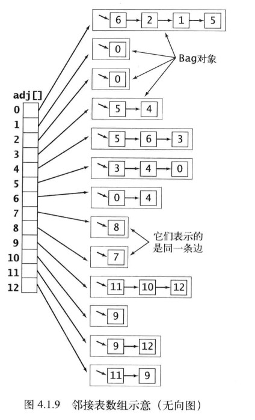

2018-09-02

## 无向图

### 定义
1. 图是由 一组顶点和一组能够将两个顶点相连的边组成的
2. 0 至 V-1表示一张含有V个顶点的图中的各个顶点
3. v-w表示连接v和w的边(w-v)

### 特殊的图

1. 自环: 一条连接自身的边
2. 平行边: 连接同一对顶点的多条边

### 术语
1. 路径: 由边顺序连接的一系列顶点
2. 简单路径: 一条没有重复顶点的路径
    - u-v-w-x: u到x的一条路径
3. 环: 是一条至少含有一条边并且 起点和终点 相同的路径
4. 简单环: 不含有重复顶点和边的环
    - u-v-w-x-u: 从u到x再回到u的一条环
5. 长度: 路径或者环所包含的边数
6. 一个顶点和另外一个顶点是连通的: 两个顶点之间存在一条连接双方的路径
7. 连通图: 从任意一个顶点都存在一条路径到达另一个任意顶点
8. 非连通图: 由若干连通的部分组成, 都是其极大连通子图
9. 无环图: 一种不包含环的图
10. 树: 一种无环连通图
11. 森林: 互不相连的树组成的集合

### 树与图的转换
1. 当且仅当 一副含有V个节点的图G满足下列5个条件之一时, 它就是一颗树
    - G 有 V-1 边, 不含有环
    - G 有 V-1 边, 连通的
    - G 是连通的, 且删除任意一条边都会使他不在连通
    - G 是无环图, 但 添加任意一条边都会产生一个环
    - G 中任意一堆顶点之间仅存在一条简单路径
    
### 对处理图的数据结构的要求
1. 必须为可能在应用中碰到的各种类型的图预留足够的空间
2. 要快

### 数据结构
1. 邻接矩阵
    - V * V 的布尔矩阵
    - 顶点 v 与 顶点 w 有相连接的边, 定义 (v,w) = true;
    - **上百万个顶点的图狠常见, V²个布尔值所需的空间不足**
    - **无法表示平行边**
2. 边的数组
    - Edge类, 包含2个int变量, 
    - **要实现 adj() 需要检查图中的所有的边**
3. 邻接表数组
    - 
    - 以顶点为索引的列表数组
    - 每个元素都是和该顶点相邻的顶点元素

### 邻接表的数据结构
1. 每条边出现两次
2. 使用的空间和 V+E 成正比
3. 添加一条边所需的时间为常数
4. 遍历顶点 v 的所有相邻节点所需的时间和 v 的度数成正比