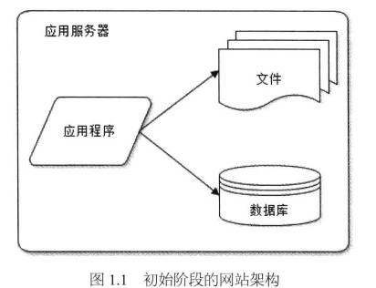
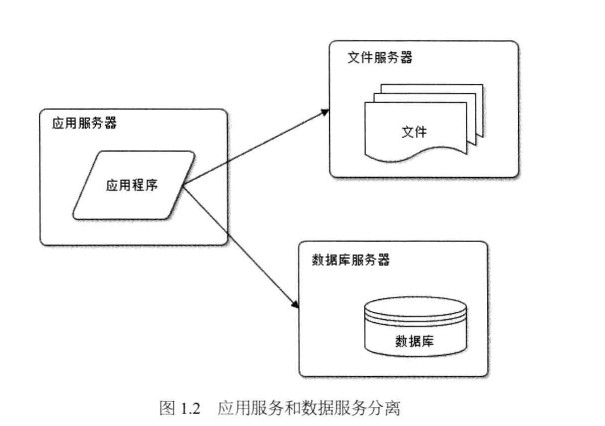
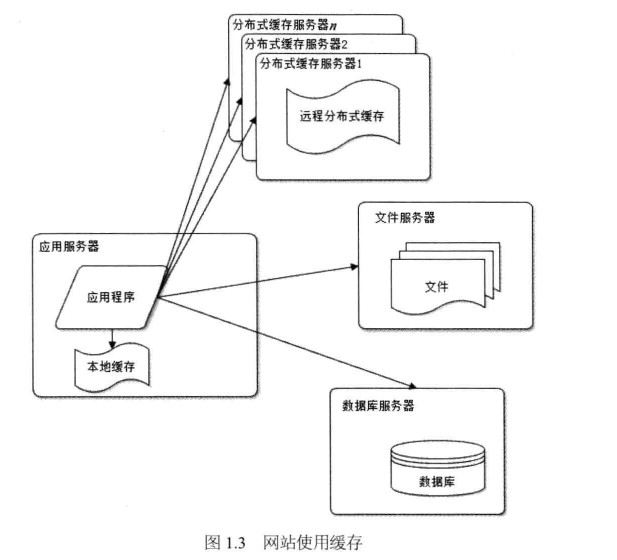
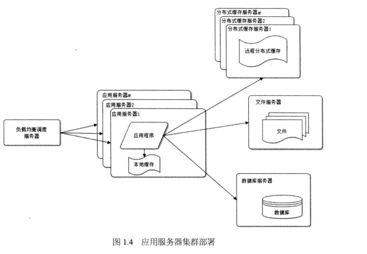
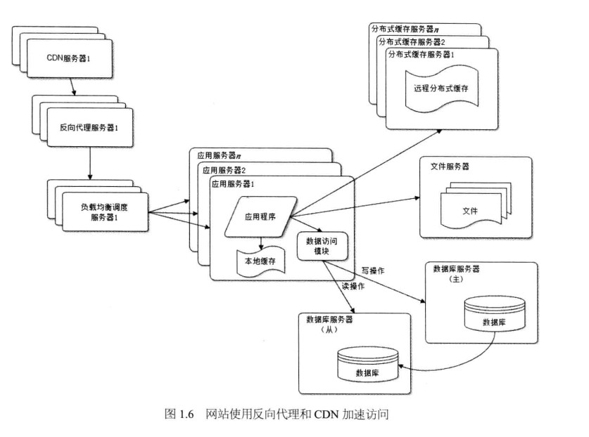
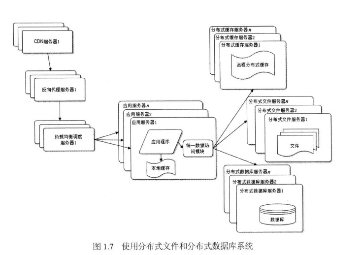
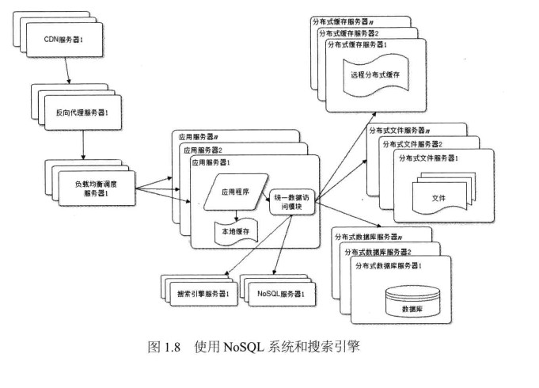
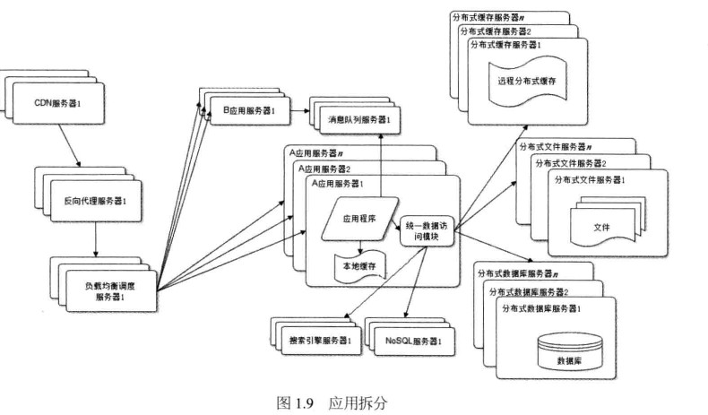
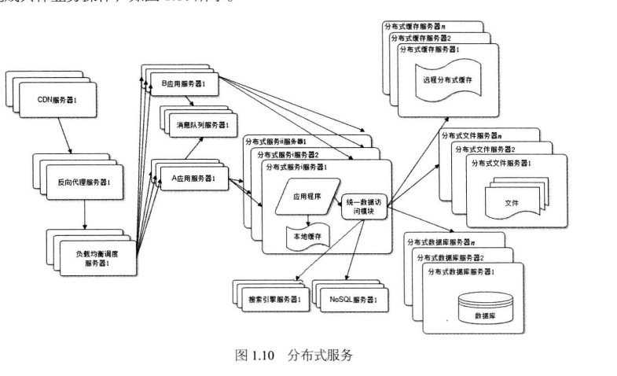

2018-12-12

## 大型网站架构演化

### 大型网站软件系统的特点
1. 高并发 大流量
    - 高并发用户, 大流量访问
2. 高可用
    - 系统7*24小时不间断服务
3. 海量存储
    - 需要存储,管理海量数据, 需要使用大量服务器
4. 用户分布广泛, 网络情况复杂
5. 安全环境恶劣
6. 需求快速变更, 发布频繁
7. 渐进式发展

### 演化发展历程
1. 初始阶段的网络架构
    - 应用程序, 数据路, 文件等所有的资源都在一台服务器
    - Linux+PHP+Apache+Mysql
     
    
2. 应用服务和数据服务分离
    - 问题
        - 越来越多的用户导致性能越来越差, 
        - 越来越多的数据导致存储空间不足
    - 解决
        - 应用和数据分离
        - 应用服务器需要处理大量业务逻辑--强大的CPU
        - 数据库服务器需要快速检索磁盘和数据缓存--更快的硬盘和更大的内存
        - 文件服务器需要存储大量用户上传的文件,--更大的硬盘
        
    
3. 使用缓存改善网站性能
    - 问题
        - 二八定律: 80%的业务访问几种在20%的数据上
    - 解决
        - 热点数据缓存在内存中
        - 分布式缓存
    
    
4. 使用应用服务器集群改善网站的并发处理能力
    - 问题
        - 在网站的访问的高峰期, 应用服务器成为网站的瓶颈
    - 解决
        - 使用服务器集群
        - 负载均衡调度服务器
        
    
5. 数据库读写分离
    - 问题
        - 使用缓存后,大部分的数据访问不在访问数据库
        - 但是仍有部分读数据(缓存过期, 不命中), 以及全部读操作需要访问数据库
        - 用户达到一定规模之后, 数据库因为负载过大而成为网站的性能瓶颈
    - 解决
        - 数据路主从热备
        - 数据库读写分离
    
    
6. 反向代理和CDN加速网站响应
    - 基本原理都是缓存
    - CDN部署在网络提供商的机房
        - 使用户可以在距离自己最近的网络获取数据
    - 反向代理则部署在网络的中心机房
    
    
7. 分布式文件系统和分部署数据库系统

    
8. 使用NoSql和搜索引擎
    - 随着网站业务越来越复杂, 对数据存储和检索的需求也越来越复杂
    - 应用服务器通过统一的数据访问模块访问各种数据
     
    
9. 业务拆分
    - 根据产品线划分, 将一个网站查分成许多不同的应用, 每个应用独立部署
    - 通过消息队列或者同一个数据存储系统来构建一个关联的完整系统     

    
10. 分布式服务
    - 问题
        - 业务拆分越来越小, 存储系统越来越庞大, 应用程序的整体复杂度呈指数级增长
        - 部署维护越来越困难
        - 数据库资源不足, 造成拒绝连接
    - 解决
        - 每一个应用系统大多执行许多相同给的业务操作, 
        - 提取共用的业务, 独立部署
        
    

### 网站架构设计的误区
1. 一味追随大公司的解决方案
    - 不要盲从
2. 为了技术而技术
    - 网站技术因为业务而存在
3. 企图用技术解决所有问题

