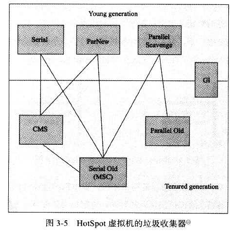
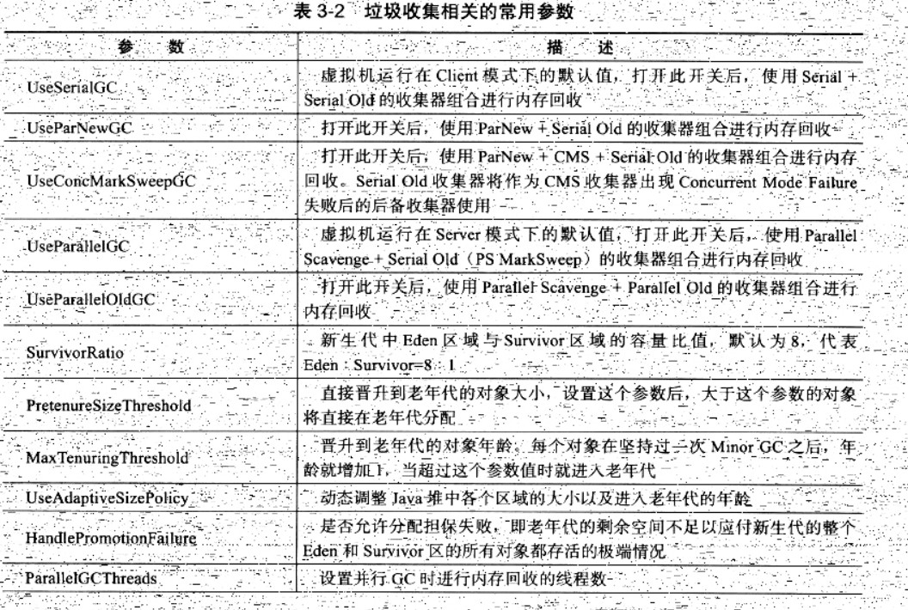

2018-09-21

## 垃圾收集器

### HotSpot

### Serial / Serial old 收集器

1. 单线程
    - 只使用一个CPU或一条收集线程去完成垃圾收集工作
    - **进行GC的时候, 必须暂停其他所有的工作线程** -- STW
2. 新生代(Serial)
    - 复制
    - STW
4. 其他特点(Serial)
    - **可以配合CMS使用**    

### ParNew / ParNew old 收集器

1. Serial的多线程版本
2. 新生代(ParNew)
    - 复制
    - STW
3. 老年代(ParNew old)
    - 标记-整理
    - STW
4. 其他特点(ParNew)
    - **可以配合CMS使用**
    - 在JDK1.5 中, CMS收集老年代的时候, 新生代只能选择ParNew, Serial其中一个, 
    - -XX:+UseConcMarkSweepGC 选线的默认新生代收集器
    - -XX:+UseParNewGC 强制指定
5. **注:并行, 用户线程依然停止**
    
### Parallel Scavenge 收集器
1. 特点
    - 新生代收集器
    - 复制
    - 并行的多线程
    - VS ParNew
        - 达到一个可以控制的吞吐量
        - 高效率利用CPUs时间, 尽快完成程序的运算任务
        - 适合: 后台运算而不需要太多交互的任务
        
### Serial old
1. 单线程
1. 老年代(Serial old)
    - 标记-整理
    - STW
    - **作为CMS收集器的后备方案**
        - **在并发收集器发生 Concurrent Mode Failure 时使用**

### Parallel old 收集器
1. 多线程
2. 标记-整理
3. **配合 Parallel Scavenge 收集器 实现高吞吐量**

### CMS(Concurrent Mark Sweep) 收集器

1. 目标
    - 获取最短回收停顿时间
2. 实现
    - **标记-清除**
3. 步骤
    - 初识标记 (CMS initial mark)
        - **STW**
        - 单线程，由于是从GCRoot寻找直达的对象，速度快
    - 并发标记 (CMS concurrent mark)
        - 与应用线程一起运行，是CMS最主要的工作阶段，通过直达对象，扫描全部的对象，进行标记
    - 重新标记 (CMS remark)
        - **STW**
        - 修正并发标记期间因用户程序继续运作而导致标记产生变动的那一部分对象的标记记录
    - 并发清除 (CMS concurrent sweep)
4. 特点
    - 并发收集, 低停顿
    - **新生代：复制算法，默认搭配ParNewGC，并行**
5. 缺点
    - CMS收集器对CPU资源非常敏感
        - 并发设计
        - 回收线程数 = (CPUs + 3) / 4, CPU越多, 占用的资源越多
        - 对用户程序影响大
    - 无法处理浮动垃圾, Concurrent Mode Failure 导致另外一处 Full GC 的发生
        - 并发清理阶段用户线程产生的新垃圾(浮动垃圾)需要下一次GC清理
    - 标记-清除
        - 收集接收后, 大量的空间碎片
        - 压缩
        - -XX:CMSFullGCsBeforeCompaction：由于并发收集器不对内存空间进行压缩、整理，所以运行一段时间以后会产生“碎片”，
            使得运行效率降低。此值设置运行多少次GC以后对内存空间进行压缩、整理。
        - -XX:+UseCMSCompactAtFullCollection：打开对年老代的压缩。可能会影响性能，但是可以消除碎片

### G1收集器

1. 标记-整理
2. 精确的控制停顿--> 避免全区域的垃圾回收
3. 将整个 JAVA 堆划分为多个大小固定的独立区域,跟踪每个区域的垃圾堆积程度.
4. 后台维护一个优先列表, 根据允许的收集时间,优先回收垃圾最多的区域
5. 区域划分 以及 优先级的区域回收, 保证了 G1 收集器在优先的时间内可以获取更高的手机效率

### 垃圾收集器参数

