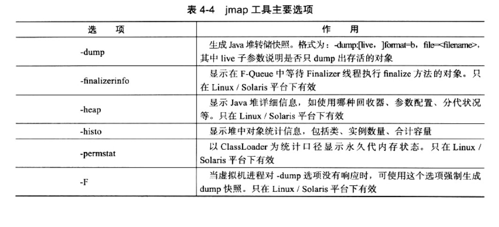

2018-09-22

## 性能监控与故障处理

### 监控与处理工具

### JDK命令工具
1. jps
    - jvm Process Status Tool, 虚拟机进程状况工具
    - jps [options] [hostid]
    - 参数
        - -l: 输出主类的全名, 如果是jar包, 输出jar路径
        - -v: 输出虚拟机进程启动时 JVM 参数
2. jstat
    - JVM Statistics Monitoring Tool 虚拟机统计信息监控工具
    - [jstat.md](jstat.md)
3. jinfo
    - Configuration info for java java配置信息工具
    - jinfo [option] pid
4. jmap
    - Memory Map For Java java内存映射工具 -- 生成堆转储快照(heapdump/dump文件)
    - 作用
        - finalize执行队列
        - java堆和永久代的详细信息
            - 空间使用率
            - 使用的收集器
    - jmap [option] vmid
    - 
5. jhat
    - JVM Heap Analysis Tool 虚拟机堆转储快照分析工具
    - mat(MemoryAnalyzer)
6. jstack
    - Stack Trace for java java堆栈跟踪工具
    - 当前时刻的线程快照
        - threaddump
    - 用处
        - 定位线程出现长时间停顿的原因
            - 线程死锁
            - 死循环
            - 请求外部资源导致的长时间等待
    - jstack [option] vimd
    - 参数
        - -F: 正常输出的请求不响应, 强制输出线程堆栈
        - -l: 除了线程堆栈外, 显示关于锁的附加信息
        - -m: 如果调用了本地方法的话, 显示 C/C++的堆栈
        
### 命令
1. 查看线程的堆栈信息 : jstack -l pid(/jstack -l pid >> ~/jstack.txt)
2. dump堆内的对象 : jmap -dump:live,format=b,file=xxx pid
3. -XX:+HeapDumpOnOutOfMemoryError -XX:HeapDumpPath=xxx  -- 设置JVM参数，当JVM OOM时输出堆的dump
4. 获得当前系统占用CPU最高的10个进程，线程 ps Hh -eo pid,tid,pcpu,pmem | sort -nk3 |tail > temp.txt
        
### JDK的可视化工具
1. JConsole
2. VisualVM