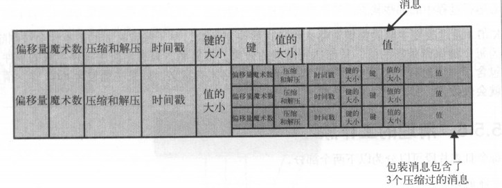

2019-01-20

## 深入 Kafka

### 集群成员的关系
1. 使用 zookeeper 来维护集群成员的关系
    - 每一个 broker 有一个唯一的标识符
2. /brokers/ids
3. 在 broker 停机, 出现网络分区, 长时间的垃圾回收停顿
    - broker 会从 Zookeeper 上断开连接, 

### 控制器
1. 就是一个 broker
    - 除了负责一般 broker 的功能之外, **还负责分区首领的选举**
2. 步骤
    - 集群中第一个启动的broker 在 Zookeeper 中创建一个临时节点 /controller 让自己成为控制器
    - 其他节点 在控制器上创建 Zookeeper watch 对象, 收到节点变更的通知
    - 收到节点变更的通知, 会有一个新的先启动的 broker 成为新的 控制器
    - 新的 控制器通过 Zookeeper 的条件递增操作获取一个全新的, 数值更大的 controller epoch, 
    - 其他broker 知道当前的 controller epoch 之后, 如果控制器发出的包含旧的 epoch, 忽略
3. 使用 epoch 来避免 脑裂

### 复制
1. Kafka 使用主题来组织数据, 每个主题被分为若干个分区, 每个分区有多个副本
2. 副本的类型
    - 首领副本
        - 每一个分区都有一个首领副本, 
        - **保持一致性, 所有生产者和消费者的请求都会经过这个副本**
    - 跟随者副本
        - **首领之外的副本**
        - 跟随者副本不处理来自客户端的请求, 唯一任务是从首领哪里复制消息, 保持与首领的一致性
3. 首领的另外一个任务--搞清楚哪个追随者的状态和自己是一致的
4. 跟随者的正常不活跃时间或在成为不同步副本之前的时间
    - replica.lag.time.max.ms
    - **这个时间间隔直接影响首领选举期间的客户端行为 和 数据保留机制**
5. 首选首领
    - 除了当前首领之外, 每一个分区都有一个 **首选首领**
    - 创建主题时选定的首领就是分区的首选首领
    - 在创建分区时, 需要在broker 之间均衡首领
    - auto.leader.rebalance.enable
        - **检查首选首领是否是 当前首领, 如果不是, 并且该副本是同步副本, 触发首领选举, 让 首选首领成为当前首领**
        
### 处理请求
1. 消息头
    - Request type(API Key)
    - Request Version
    - Correlation ID 唯一性数字
    - Client ID(标识 客户端)
2. 元数据请求
    - 客户端通过获取 元数据 知道往哪里发送请求
    - 主题的分区, 分区的副本, 分区的首领
3. 生产请求
    - acks
4. 获取请求
    - **零复制**
        - kafka 直接把消息从文件(Linux 文件系统缓存) 发送到网络通道, 不需要经过中间缓冲区
    - 设置 broker 返回数据的上限和下限
    - **大部分客户端只能读取已经被写入所有同步副本的消息**
        - 如果 broker 间的消息复制因为某些原因变慢, 消息到达消费者的时间也会增加
        - replica.lag.time.max.ms: 指定副本在复制消息是可被允许的最大延迟时间
        
### 物理存储
1. 基础存储单元是 分区
    - 无法在多个 broker 之间进行在细分
    - 无法再同一个 broker 的多个磁盘上进行细分
2. 分区分配
    - 6个 broker, 10个分区的主题, 复制系数3 --> 30个分区副本
        - 在 broker 间平均分布分区副本 5分区/broker
        - 每个分区的每个副本 分布在不同分区
        - 如果为 broker 指定了机架信息, 尽可能的每个分区的副本分配到不同机架的 broker 上
3. 文件管理
    - 一个分区分为若干个片段, 默认1G或者一周, 达到片段上限, 关闭并打开一个新的
    - 正在写入数据的片段是 **活跃片段**
        - **活跃片段永远不会被删除**
4. 文件格式
    - 如果生产者发送的是压缩的消息, 同一批次的消息会被压缩到一起
    - 
    

5. 索引
    - 映射片段文件和偏移量 在文件中的位置
6. 清理的工作原理
    - TODO
7. 