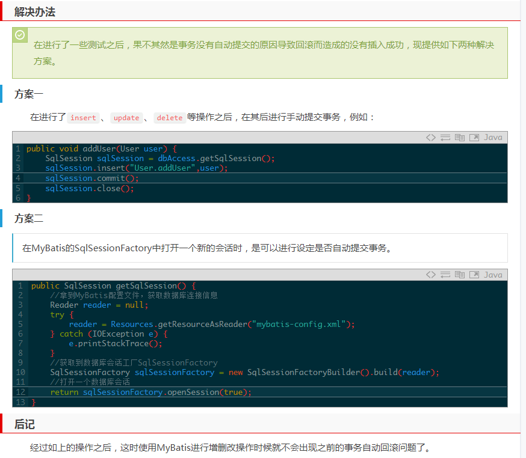

2018-01-04

### mybatis中的# 和$ 的区别
1. -- #{ } 解析为一个 JDBC 预编译语句（prepared statement）的参数标记符
    - select * from user where name = #{name}; --> select * from user where name = ?;
    - Mybatis会把这个参数认为是一个字符串
2. ${ } 仅仅为一个纯碎的 string 替换，在动态 SQL 解析阶段将会进行变量替换
    - select * from user where name = '${name}'; --> select * from user where name = "ruhua";
3. 总结
    - 能使用 #{ } 的地方就用 #{ }
    - 表名作为变量时，必须使用 ${ }
        - select * from #{tableName} where name = #{name}; --> select * from ? where name = ?; --> select * from 'user' where name='ruhua';
    - ${ } 在预编译之前已经被变量替换了，这会存在 sql 注入问题
    - $方式一般用于传入数据库对象，例如传入表名
    - 只能${}的情况,order by、like 语句只能用${}了,用#{}会多个' '导致sql语句失效.


### Mybatis 配置文件
1. configuration节点为根节点。
2. 在configuration节点之下，我们可以配置10个子节点， 
分别为：properties、typeAliases、plugins、objectFactory、objectWrapperFactory、settings、environments、databaseIdProvider、typeHandlers、mappers

### Properties 与 XML 同时配置
1. 优先读取XML中的数据, 然后读取 Properties, 相同的key覆盖
```javascript
Properties defaults = context.getChildrenAsProperties();
String resource = context.getStringAttribute("resource");
String url = context.getStringAttribute("url");
if (resource != null && url != null) {
  throw new BuilderException("...");
}
if (resource != null) {
  defaults.putAll(Resources.getResourceAsProperties(resource));
} else if (url != null) {
  defaults.putAll(Resources.getUrlAsProperties(url));
}
```
### 关键字
1. 动态代理(Mapper)
2. 缓存(一,二级缓存)
3. 数据库连接池(最大活动连接, 最大空闲连接, 最大空闲时间)
4. **动态SQ**L
5. sql文件统一存放
6. **结果映射**

### 关键类


### 配置多个 environment 子节点
```javascript
//类似于这样： <environments default="development"><environment id="development">...</environment><environment id="test">...</environments>
//意思就是我们可以对应多个环境，比如开发环境，测试环境等， 由environments的default属性去选择对应的enviroment
String id = child.getStringAttribute("id");
//isSpecial就是根据由environments的default属性去选择对应的enviroment
if (isSpecifiedEnvironment(id)) {
    //事务， mybatis有两种：JDBC 和 MANAGED, 配置为JDBC则直接使用JDBC的事务，配置为MANAGED则是将事务托管给容器， 
    TransactionFactory txFactory = transactionManagerElement(child.evalNode("transactionManager"));
    //enviroment节点下面就是dataSource节点了，解析dataSource节点（下面会贴出解析dataSource的具体方法）
    DataSourceFactory dsFactory = dataSourceElement(child.evalNode("dataSource"));
    DataSource dataSource = dsFactory.getDataSource();
    Environment.Builder environmentBuilder = new Environment.Builder(id)
          .transactionFactory(txFactory)
          .dataSource(dataSource);
    //老规矩，会将dataSource设置进configuration对象
    configuration.setEnvironment(environmentBuilder.build());
}
```

### TypeHandler

1. <font color=red>无论是 MyBatis 在预处理语句（PreparedStatement）中设置一个参数时，还是从结果集中取出一个值时，
                   都会用类型处理器将获取的值以合适的方式转换成 Java 类型。Mybatis默认为我们实现了许多TypeHandler, 
                   当我们没有配置指定TypeHandler时，Mybatis会根据参数或者返回结果的不同，默认为我们选择合适的TypeHandler处理。</font>
2. typeHandler的主要作用就是将 Java数据类型 和 Sql的数据类型对应起来, 根据不同的类型 设置sql参数, 结果转换. 省略了我们在 JDBC过程中,获取结果集的时候
还要去set的过程

### plugin

1. plugins 是一个可选配置。mybatis中的plugin其实就是个interceptor， 它可以拦截Executor 、ParameterHandler 、ResultSetHandler 、StatementHandler 的部分方法，处理我们自己的逻辑               

### insert数据无法进入数据库的问题 (事务没有自动提交)



### 结果集转换
1. ``@MapKey("age")``
2. 默认是 javabean的变量名字和数据库的字段名是一致的, 如果不一致, 需要resultMap(反射 set get)


### 动态sql
1. [动态sql](http://www.cnblogs.com/dongying/p/4092662.html)

### Mybatis 一级缓存
- Mybatis一级缓存的生命周期和SqlSession一致。
- Mybatis的缓存是一个粗粒度的缓存，没有更新缓存和缓存过期的概念，同时只是使用了默认的hashmap，也没有做容量上的限定。
- Mybatis的一级缓存最大范围是SqlSession内部，有多个SqlSession或者分布式的环境下，有操作数据库写的话，会引起脏数据，建议是把一级缓存的默认级别设定为Statement，即不使用一级缓存。

### Mybatis 二级缓存
- Mybatis的二级缓存相对于一级缓存来说，实现了SqlSession之间缓存数据的共享，同时粒度更加的细，能够到Mapper级别，通过Cache接口实现类不同的组合，对Cache的可控性也更强。
- Mybatis在多表查询时，极大可能会出现脏数据，有设计上的缺陷，安全使用的条件比较苛刻。
- 在分布式环境下，由于默认的Mybatis Cache实现都是基于本地的，分布式环境下必然会出现读取到脏数据，需要使用集中式缓存将Mybatis的Cache接口实现，有一定的开发成本，不如直接用Redis，Memcache实现业务上的缓存就好了