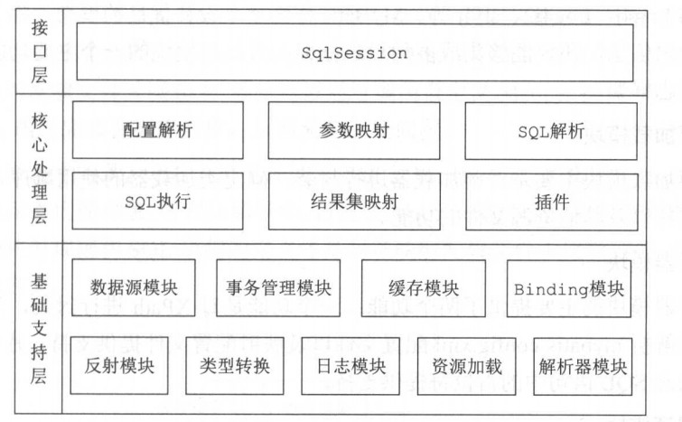
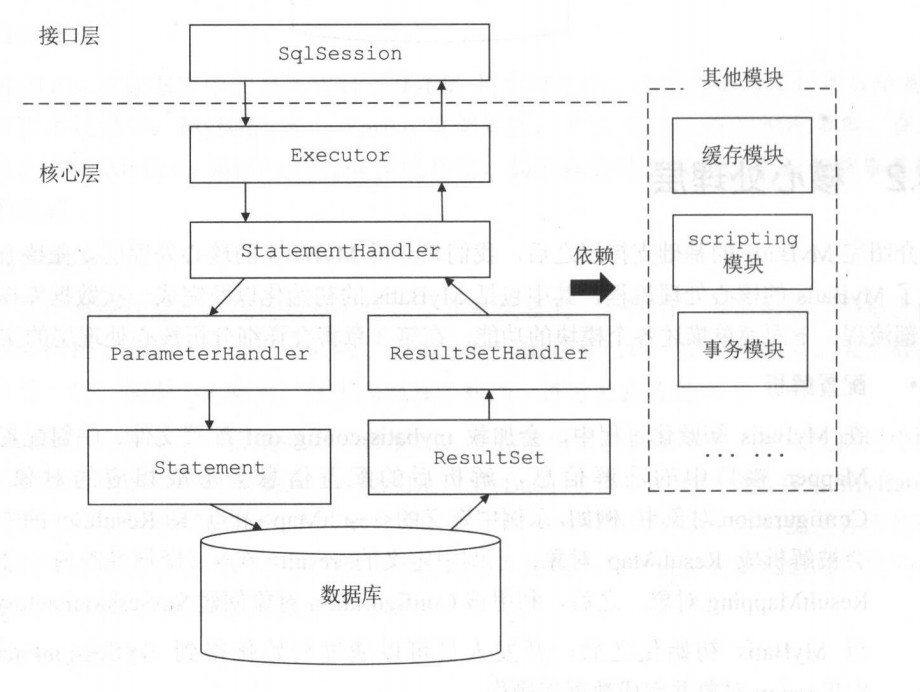

2018-11-06

## 入门

### 解决什么问题
1. 关系模型到 对象模型的转换
2. 封装这种转换
3. 映射文件

### 常见的持久化框架
1. Hibernate
    - 关系映射
    - 封装操作, 不需要直接编写SQL
    - HQL
    - 没有侵入
    - 缓存
    - 局限
        - 很难有效利用索引
        - 在 大数据量, 高并发, 低延迟的场景下不是很适合
        - 批处理支持不好
2. JPA
    - 一个规范
3. Spring JDBC
    - JDBC的简单封装
    - 多种 Template 
    - CallBack -- ResultSet
    - Spring
4. Mybatis
    - 原生SQL
    - 动态SQL

### MyBatis 整体架构

### 基础支持层
1. 反射模块
    - 封装 更易使用
2. 类型转换模块
    - 别名机制
    - JDBC类型和Java类型的相互转换
3. 日志模块
    - 集成第三方日志框架
4. 资源加载模块
5. 解析器模块
    - 解析 Mybatis-config.xml, 映射配置文件提供支持
    - 动态占位符
1. 数据源模块
    - 连接池
    - 状态监测
    - 集成第三方数据源接口
1. 事务管理
    - spring 
1. 缓存模块
    - 一级 二级 缓存
1. Binding 模块
    - 创建动态代理对象
    
### 核心处理层

1. 配置解析
    - 解析后的配置信息会保存在 Configuration 对象中
        - <ResultMap> -- ResultMap 对象
        - <result> -- ResultMaping
        - SqlSessionFactory
2. Sql 解析 与 scripting 模块
    - 拼装sql
3. Sql 执行
    - Executor
        - 一级和二级缓存
        - 事务操作
        - 数据库操作委托给 StatementHandler 
    - StatementHandler
        - 通过  ParameterHandler 完成 sql 语句的实参绑定
        - 执行sql 获取结果集
    - ParameterHandler
    - ResultSetHandler
        - 结果映射
        - 对象返回
1. 插件
    - 扩展
    - 影响核心行为
    - 充分了解 Mybatis 原理    