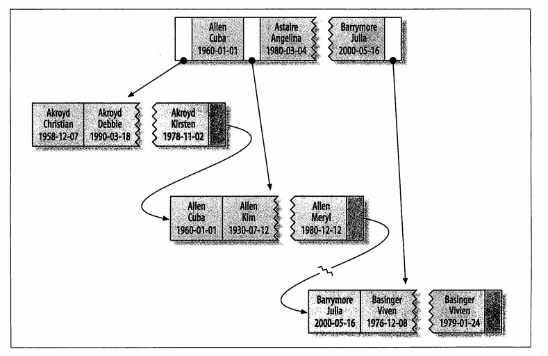

2018-09-12

## 索引基础

### 索引的类型
1. **索引是在存储引擎实现的**
2. B-Tree索引
    - 以(last_name, first_name, dob)为主键
        
    - 有效查询(适用于排序)
        - 全值匹配
            - 所有列
        - 匹配最左前缀
            - 值使用索引的第一列
        - 匹配范围值
            - 查找姓在 XXX 和 YYY 之间的人
        - 精确匹配某一行并范围匹配另外一行
            - 第一列 last_name 全匹配, 第二列first_name 范围匹配
        - 只访问索引的查询(覆盖索引)
            - 只需要访问索引, 无需访问数据行
    - 索引限制
        - 如果不是按照索引的最左列开始查找, 则无法使用索引
        - 不能跳过索引中的列
        - 如果对某个列进行范围查找, 右边的所有列无法使用索引进行优化
    - 总结
        - 索引顺序很重要
        - 可以相同的索引列, 不同给的索引顺序来优化查询
3. 哈希索引
    - 基于哈希表实现
    - 精确匹配所有列的查询才有效
    - 对所有的索引计算一个哈希码
    - 优点
        - 结构紧凑
        - 索引查找速度快
    - 限制
        - 只包含哈希值以及行指针, 而不是存储字段值
        - 不是顺序存储, 无法用于排序
        - 不支持部分索引查找
        - 只支持等值比较查询
        - 访问速度快, 但是尽量减少哈希冲突(链表)

### 自适应哈希索引
1. 由InnoDB自己决定，不需要DBA人为干预。它是通过缓冲池中的B+树构造而来，且不需要对整个表建立哈希索引，因此它的数据非常快

### 全文索引
1. TODO

### 索引的优点
1. 减少服务器需要扫描的数据量
2. 避免排序和临时表
3. 将随机I/O 变为 顺序 I/O

### 索引是否是最好的解决方案
1. 中大型的表 索引是一个较好的解决方案
2. 对于特大型的表, 建立索引的代价越来越大
    - 分区技术 TODO
3. 元数据信息表
    - 表的数量特别多
    - 需要的往往是一组数据 而不是单条数据

### 高性能的索引策略
1. 独立的列
    - 不能使表达式的一部分
    - 不能使函数的参数
2. 前缀索引和索引选择性
    - 