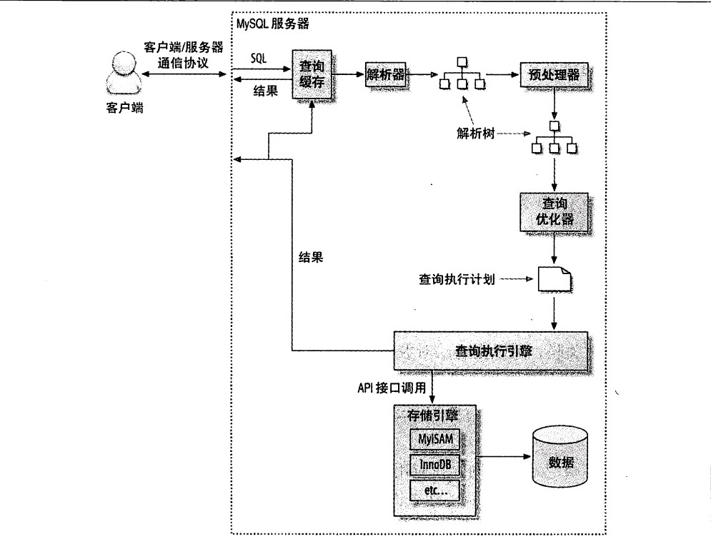

2018-03-22

## 查询性能优化

### 一次查询涉及到的子任务
1. client-server 网络IO
2. 服务器解析 CPU
3. 生成执行计划 CPU
4. 执行 本地IO, 锁
5. 返回客户端 网络IO

### 三项优化
1. 查询优化
2. 索引优化
3. 库表结构优化

### 优化数据访问
1. 查询不需要的记录
    - Limit
    - 多余的列, 重复查询相同的记录
    - 延迟关联 inner join
2. 多表关联返回全部列
    - 只取需要的列
3. 总是取出全部列
    - 有坏处
    - 有好处
4. 重复查询
    - 缓存
1. 查询需要扫描大量数据, 但只返回少数的行, 优化技巧:
    - 使用索引覆盖扫描, 在所有需要的列都在到索引中去
    - 改变库表的表结构. eg:使用单独的汇总表
    - 重写这个复杂的查询, 让Mysql优化器已更优化的方式执行查询

### 访问(扫描)类型
1. 扫描表
2. 扫描索引
3. 范围访问
4. 单值访问
    
### 重构查询方式
1. 一个复杂查询 还是 多个简单查询
2. 切分查询
    - 将大查询切分且小查询, 降低锁住的数据量
3. 分解关联查询
    - 让缓存的效率更高: 让应用程序方便缓存单表查询的结果
    - 分解后, 执行单个查询减少锁的竞争
    - 在应用层做关联, 更容易对数据库进行拆分, 更容易做到高性能和可扩展
    - 提高本身的查询效率
    - 减少冗余记录的查询
    
    
### 查询执行的基础
       

1. 客户端发送一条查询给服务器
2. 检查缓存, 命中缓存直接返回, 没有进行下一步
3. 服务器进行sql解析, 预处理, **再由优化器生成对应的执行计划**  
4. Mysql个根据执行计划, 调用存储引擎的API执行查询
5. 返回结果给客户端

### Mysql 客户端/服务器 通信协议
1. "半双工":同一时刻, 要么 server-->client, 要么 client--> server
    - 客户端必须等待数据全部接收完成
2. 当查询语句很长的时候 , 参数max_allowed_packet 就很重要了
3. 必要的时候在查询中加入LIMIT

### 查询状态(show full processlist --> 所有的Command)
1. sleep
    - 线程等待客户端发送新的请求
2. Query
    - 线程正在执行查询或者正在将结果发送给客户端
3. Locked
    - Mysql 服务层, 该线程正在等待锁
4. Analyzing and statistics
    - 线程正在收集存储引擎的统计信息, 生成查询的执行计划
5. Copying to tmp table [on disk]
    - Group by, 文件排序, Union
6. Sorting result
    - 线程正在对结果集进行排序
7. Sending data
    - 线程可能在多个状态之间传送数据
    - 生成结果集
    - 在客户端返回数据
    
### 查询缓存
1. 大小写敏感的哈希表

### 查询优化处理
1. 解析sql 
    - 解析树
    - 验证sql
2. 预处理
    - 进一步检查解析树是否合法
    - 验证权限
3. 查询优化器
    - 一条查询可以有很多执行方式, 返回相同的结果
    - 选择最好的计划
    
### 优化类型
1. 重新定义关联表的顺序
2. 将外连接转化为内连接
3. 使用等价变换规则
4. 优化 count(), min(), max()
    - min: B-Tree 最左边
    - max: B-Tree 最右边
5. 覆盖索引扫描
6. 子查询优化
7. 提前终止查询
8. 列表 In()
    - IN() 列表中的数据先排序, 二分查找, O(logn)

### 关联查询
1. mysql中每一次查询就是一次关联
    - 读取结果临时表也是一种关联
2. 第任何关联都执行 嵌套循环关联操作

### 执行计划
1. 生成查询的一颗指令树
2. 不是一颗平衡树, 而是左侧深度优先的树
    - mysql总是 嵌套循环, 回溯完成所有关联的表
    
### 关联查询优化器
1. 选择合适的关联查询让查询执行的成本尽可能低
    - 重新定义关联的顺序
2. 问题
    - 当有超过 N 个表的关联, 需要检查 n 的阶乘种关联顺序
        - 可能的执行计划的"搜索空间"
        - 搜索空间增长非常--N
    - 当 N > optimizer_search_depth
        - 贪婪搜索模式
        
### 排序优化
1. 成本很高的操作
    - 避免排序或者避免大数据排序
1. 数据量小在内存, 大在硬盘
    - filesort
    - 排序缓冲区
        - 小于
            - 内存 快速排序
        - 大于
            - 数据分块
            - 对每个独立的块 快速排序
            - 合并(merge), 返回
2. 关联查询时候的排序
    - orde by
        - 子句的所有列都来自关联的第一个表
            - 在关联处理的第一个表的时候就进行文件排序
        - 不是
            - 将关联的结果放到临时表中, 在所有关联结束后, 再进行文件排序
    - limit
        - **会在排序之后应用, 即使返回较少的数据, 临时表和需要排序的数据量也是非常大**
        - Mysql 5.6 返回部分排序结果时, 抛弃不满足条件的结果, 然后进行排序
        
### 查询执行引擎
1. 底层接口简单, 数量少, 搭积木的方式完成操作
     
### 返回结果给客户端
1. 这个阶段 将结果放入缓存中
1. **是一个增量, 逐步返回的过程**
    - 无需存储过多的结果, 节省内存
    - 客户端第一时间获取返回的结果

### Mysql查询优化器的局限
1. where 条件中包含 In() 的子查询语句
    - Mysql5.5
        - 将外层表压入子查询中
        - 然后在子查询中对外层表全表扫描
    - Mysql5.6
        - 已优化

### 索引合并优化
1. 最大值和最小值优化
    - min(), max()
        - 如果 where 字段中没有建立索引, 就会全表扫描
        - 如果进行主键扫描
            - 满足条件的第一个记录就是需要寻找的值
        - mysql 的优化方式
            - select min(field) from xxx  where con, 优化为↓
            - select field from xxx USE INDEX(PRIMARY) where con LIMIT 1;
            
### 查询优化器的提示
1. TODO

### 优化特定类型的查询
1. count()
    - 作用
        - 统计某个列值的数量, 统计行数
        - 统计结果集的行数
    - count(*)
        - 直接忽视所有的列而直接统计所有的行数
        - 非常快
    - 简单的优化
        - 查询 ID 大于5的城市数
            - select count(*) from world.city where id > 5;
            - 优化: select (select count(*) from world.city) - count(*) from world.city where id <= 5;
            - **减少扫描的行数** 
        - 同一个查询中统计同一个列的不同值的数量, 已减少查询的语句量: 查询各个不同颜色的商品的数量  
            - 分析
                - 不能使用 OR, 无法区分不同颜色的商品数量
                - 不能在 where 条件中指定颜色
            - 解决
                - select sum(if(color = 'blue',1,0)) as blue, sum(if(color = 'red',1,0)) as red from items;
                - select count(color = 'blue' or null) as blue,count(color = 'red' or null) as red from items; 
    - 使用近似值
        - explain 可以获取近似值
    - 更复杂的优化
        - 索引覆盖
        - 汇总表
        - 外部缓存系统
2. 优化关联查询
    - 确保 ON 或 USING 子句列上有索引
    - 确保任何 Group by, Order by 中的表达式只涉及到一个表中列
3. 优化 Group by, Distinct
    - 索引
4. 优化 Limit 分页
    - 通常: limit + 偏移量 + 合适的 order by 子句
    - 当偏移量非常大的时候
        - limit 10000, 20
            - 需要查询 10020 条数据, 然后丢弃前 10000, 返回后20
        - 优化
            - 使用索引覆盖
                - 延迟关联
                    - select field1, field2 from xxx order by con limit n, m;
                    - 优化为: select field1, field2 from xxx inner join (select key from xxx oder by con limit n, m) as ttt useing(key)
            - order by desc limit
            - 汇总表
            - 关联到一个冗余表
                - 只包含 主键列和需要做排序的数据列
5. 使用用户自定义变量
    - TODO
    
    
### 案列学习
[案列学习](case_study.md)