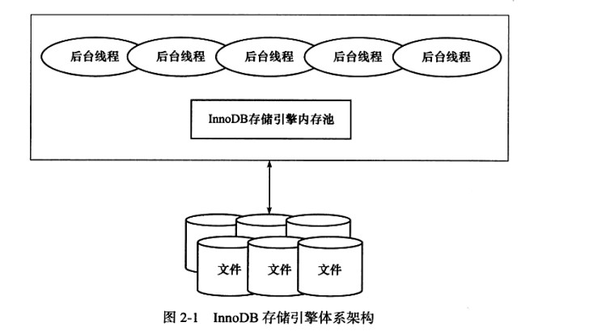

2019-01-24

## InnoDB 存储引擎

### InnoDB 体系结构

### 后台线程
1. 作用
    - 主要负责 刷新内存池中的数据, 保证缓冲池中内存缓存的是**最近的数据**
    - **将已修改的文件刷新到磁盘**
    - 保证在数据库发生异常的情况下 InnoDB 能恢复到正常的状态
2. Master Thread
    - 将缓冲池中的数据**异步刷新到磁盘**, 保证数据一致性
    - 脏页的刷新, 合并插入缓冲(Insert Buffer)
    - Undo 页的回收
3. IO Thread
    - AIO
    - InnoDB 1.0之前 4个IO Thread
        - write
        - read
        - insert buffer
        - log
    - 1.0.x开始
        - read, write 增大到4个
        - innodb_read_io_threads, innodb_write_io_threads配置
    - Purge Thread
        - 事务被提交后, 其所使用的 undolog 可能不需要, 需要 PargeThread 回收已经使用并分配的 undo 页
        - Innodb 1.1 开始, purge 操作可以在单独的线程中进行
        - innodb_purge_thread=1 启用
    - Purge Cleaner Thread
        - Innodb 1.2.x
        - 将之前版本中脏页的刷新操作都放入到单独的线程中完成

### 内存
1. 缓冲池
    - Innodb 基于磁盘存储, 将其中的记录按照页的方式进行管理
    - 读取页 <--> 缓冲池 <-->磁盘
    - 修改操作
        - 先修改缓冲池中的页, 再以一定的频率刷新到磁盘上
        - Checkpoint 机制
    - innodb_buffer_pool_size(byte)
    - 缓存的数据页类型
        - 索引页
        - 数据页
        - undo页
        - 插入缓冲
        - 自适应哈希索引
        - Innodb 存储的锁信息
        - 数据字典信息
    - 多个缓冲池实例
        - innodb 1.0.x
        - 每个页根据哈希值平均分配到不同的缓冲池, 减少资源竞争, 提高并发能力
2. LRU List, Free Lis,  Flush List(内存管理) 
    - 缓冲池通过 LRU 算法进行管理
    - 当缓冲池无法存放新读取到的页时, 首先释放LRU列表中尾端的页
    - 页 默认大小 16KB
    - midpoint insertion strategy
        - 新读取到的页不直接放入LRU列表的首部
        - 放入列表的 midpoint 位置
        - innodb_old_blocks_pct 指定 是一个 百分比
        - 默认 3/8处(列表尾端的37%)
        - midpoint之后的 old列表 
        - midpoint之前的 new 列表
        - innodb_old_blocks_time
            - **表示页读取到mid位置后需要等待多久才会被加入到LRU列表的热端**
3. 脏页
    - 在LRU列表中的页被修改后(缓冲池中的页和磁盘上的页的数据不一致)
    - checkpoint 机制刷新回磁盘
    - Flush 列表中的页就是 脏页列表
    - 脏页即存在与 Flush  列表中, 也可能存在于 LRU 列表中
4. 重做日志缓冲(redo log buffer)
    - 先将重做日志信息先放入这个缓冲区, 然后按照一定的频率将其刷新到重做日志文件
        - Master Thread 每一秒将重做日志缓冲刷新到重做日志文件
        - 每个事物提交的时会...
        - 当重做日志缓冲池的剩余空间小于1/2...
        
### CheckPoint技术
1. 
