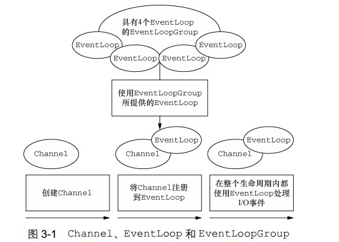

2018-01-23

## Netty 组件与设计

### Channel, EventLoop, ChannelFuture
1.  Channel---Socket
    - 对 socket的包装
    - NioSocketChannel
2. EventLoop接口---控制流, 多线程处理, 并发

    - EventLoopGroup--多个 EventLoop
    - 一个 EventLoop 在它的生命周期内只和一个 Thread 绑定
    - **所有 由 EventLoop 处理的 IO 事件都将在它专有的 Thread上被处理**
    - 一个 Channel 在它的生命周期内只注册于一个 EventLoop
    - 一个 EventLoop 可以被分配多个 Channel
    - **一个给定 Channel 的 I/O 操作都是由相同的 Thread 执行的， 实际
      上消除了对于同步的需要**
3. ChannelFuture , ChannelFutureListener
    - ChannelFuture就是一个占位符, 
    - ChannelFutureListener才是被通知后具体的处理逻辑
    - 所属同一个Channel的操作都被保证已它们被调用的顺序执行
    
### ChannelHandler, ChannelPipeline
1. ChannelHandler
    - 所有处理入站和出站数据的应用程序逻辑的容器
    - 适配器模式
        - 编写自定义的 ChannelHandler 所需要的努力降到最低限度，因为它们提
          供了定义在对应接口中的所有方法的默认实现
    - 编码器 和 解码器
        - 终究还是 ChannelHandler
    - SimpleChannelInboundHandler<T>
        - T:如果这个处理器是第一个处理器, 那么 T=ByteBuf
        - T:经过解码器获取其他处理器可能会转化为 一个 JAVA 对象
2. ChannelPipeline
    - ChannelHandler链的容器
    - **当 Channel 被创建时, Channel会被自动分配到它专属的 ChannelPipeline**, 
    - ChannelHandler 安装到 ChannelPipeline 中的过程
        - 一个 ChannelInitializer 的实现被 注册到 ServerBootstrap
        - 当 ChannelInitializer.initChannel()被调用, ChannelInitializer 将在 ChannelPipeline 中安装一组自定义的 ChannelHandler
        - **ChannelInitializer 将自己从 ChannelPipeline中移除**
        - **ChannelHandler被添加到ChannelPipeline时, 它将会分配一个 ChannelHandlerContext, 代表两者之间的绑定**
    - 两种发送消息的方式
        - 直接写到 Channel中 : **消息从ChannelPipeline尾端开始流动**
        - 写到和 ChannelHandler 关联的 ChannelHandlerContext 对象中: **消息从 Pipeline中的下一个ChannelHandler流动**
    - **入站和出站都是对于应用本身而言**
        
### 

### xxx is not a @Sharable handler, so can't be added or removed multiple times
- http://www.fanyeong.com/2016/10/24/netty-channelhandler%E4%BD%BF%E7%94%A8%E6%8A%A5%E9%94%99/

### 数据的 出站 与 入站
1. 出站 和 入站是相对的概念
2. 入站时, channelPipeline从头到尾.
3. 出站时, channelPipeline从尾到头.