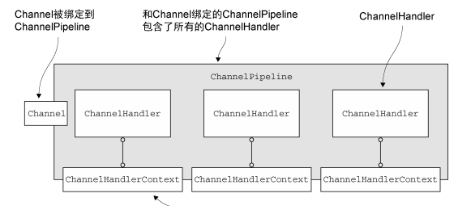

2018-01-24

## ChannelHandler ChannelPipeline

### ChannelHandler 家族
1. ChannelInboundHandler 接口
    - ChannelWritabilityChanged
        - 当channel 的可写状态发生改变的时候调用
        - 用户可以确保写操作不会完成的太快
            - 避免发生 OOM
        - 可以通过调用 Channel 的 isWritable()方法来检测
          Channel 的可写性。 与可写性相关的阈值可以通过 Channel.config().
          setWriteHighWaterMark()和 Channel.config().setWriteLowWaterMark()方法来设置
2. ChannelOutboundHandler
    - 可以按需推迟操作或者事件, 
        - **远程节点的写入被暂停, 可以推迟冲刷操作, 并在稍后继续**

### ChannelPipeline 接口
1. 每一个新创建的Channel 都将会被分配一个新的 ChannelPipeline
    - 永久性的
    - **Channel 即不能附加另外一个 ChannelPipeline, 也不能分离当前的**
2. ChannelHandler 的执行与阻塞
    - 通常 ChannelPipeline 中的 每一个 ChannelHandler 都是通过它的 EventLoop (I/O 线程)来处理传递给它的事件.
        所以至关重要的是 **不要阻塞这个线程,因为这会对整体的 I/O 处理产生负面的影响**
3. 触发事件
    - ChannelPipeline 保存了与 Channel 相关联的 ChannelHandler；
    - ChannelPipeline 可以根据需要，通过添加或者删除 ChannelHandler 来动态地修改；
    - ChannelPipeline 有着丰富的 API 用以被调用，以响应入站和出站事件。 

### ChannelHandlerContext 接口
1. ChannelHandlerContext 代表了 ChannelHandler 和 ChannelPipeline之间的关联, 
    **每当有 ChannelHandler 添加到 ChannelPipeline 中时，都会创建 ChannelHandlerContext**
2. ChannelHandlerContext 和 ChannelHandler 之间的关联是永远不会改变的, 缓存它的引用是安全的的
3. 相对于其他类的同名方法， **ChannelHandlerContext 的方法将产生更短的事件流， 应该尽可能地利用这个特性来获得最大的性能**

### ChannelHandlerContext API
1. alloc: 返回和这个实例相关联的 Channel 所配置的 ByteBufAllocator
2. read: 将数据从Channel读取到第一个入站缓冲区；如果读取成功则触
         发一个channelRead事件，并（在最后一个消息被读取完成后）
         通 知 ChannelInboundHandler 的 channelReadComplete
         (ChannelHandlerContext)方法
3. write: 通过这个实例写入消息并经过 ChannelPipeline
3. writeAndFlush: 通过这个实例写入并冲刷消息并经过 ChannelPipeline

### Channel、 ChannelPipeline、 ChannelHandler 以及 ChannelHandlerContext 之间的关系

### Pipeline 数据流转方向确定
1. 处理入站数据时, 总是查找当前 AbstractChannelHandlerContext.head.next
2. 处理出站数据时, 总是查找当前 AbstractChannelHandlerContext.tail.prev
3. 通过 instanceof 确定是 inbound 还是 outbound
4. 在查找下一个 AbstractChannelHandlerContext, 会跳过与据流转方向不符的 bound -->  `` while (!ctx.inbound)   while (!ctx.outbound)`` 

### ChannelHandler 和 ChannelHandlerContext 的高级用法
1. 可以通过将 ChannelHandler 添加到 ChannelPipeline 中来实现动态的协议切换
2. 缓存到 ChannelHandlerContext 的引用以供稍后使用，这可能会发生在任何的 ChannelHandler 方法之外，甚至来自于不同的线程
3. 因为一个ChannelHandler能够属于多个ChannelPipeline，它能够被绑定到多个ChannelHandlerContext实例上。
    - 一个用于该目的的ChannelHandler必须有@Sharable注解；
    - 如果一个不具有@Sharable注解的ChannelHandler被尝试去添加到多个ChannelPipeline中将会触发一个异常。
    - 显然，为了安全的在多个并发Channel中使用ChannelHandler，可共享的ChannelHandler必须是线程安全的。
4. 为什么要共享一个ChannelHandler ？ 
    - 一个常见的原因是：构建一个单例的ChannelHandler在多个ChannelPipeline中为了跨越多个Channels来收集统计资料。
   
### 资源管理--释放
1. 

