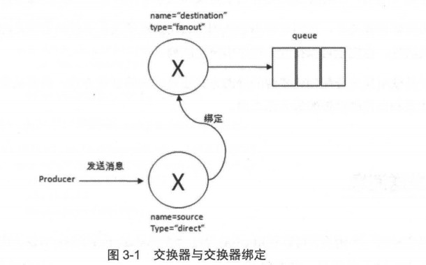

2018-08-29

## 客户端开发

### 连接MQ
1. **多线程共享Channel实例是非线程安全的**
2. isOpen()
    - 不要在生产环境使用
    - 在判断之后, 其他代码执行之前, 状态可能改变

### 交换器 与 队列
1. 尝试声明一个已经存在的交换器, 或者队列, 只要声明的参数完全匹配当前的交换器或者队列, MQ什么都不做, 并成功返回.
    如果不是, 异常

### 交换器创建
1.      Exchange.DeclareOk exchangeDeclare(String exchange,
                                                 String type,
                                                 boolean durable,
                                                 boolean autoDelete,
                                                 boolean internal,
                                                 Map<String, Object> arguments) throws IOException;
    - exchange 交换器名称
    - type 类型: fanout, direct, topic
    - durable 是否持久化
        - 可以将交换器存盘, 重启不会丢失信息
    - autoDelete是否自动删除
        - 自动删除的前提 没有一个队列或者交换器与当前交换器绑定
        - 而不是单纯的认为与此交换器连接的客户端都断开的时候, 会自动删除这个交换器
    - internal 是否内置
    - arguments 结构化的参数

### 队列创建
1.      Queue.DeclareOk queueDeclare(String queue, boolean durable, boolean exclusive, boolean autoDelete,
                                         Map<String, Object> arguments) throws IOException;
    - queue
    - durable
    - exclusive 是否排他
        - true
            - 该队列仅对**首次声明它的连接可见**, 并在连接断开的时候自动删除
            - 基于连接, 同一个连接的其他通道可见
            - 适用于一个客户端同时发送和读取消息的应用场景
    - autoDelete 
        - 没有消费者连接这个队列
2. 注意
    - 生产者和消费者都能够使用 queueDeclare 来声明一个队列，但是如果消费者在同一个
    信道上订阅了另一个队列，就无法再声明队列了。必须先取消订阅，然后将信道直为"传输" 模式，之后才能声明队列。

### 交换机之间的绑定

### 生产者和消费者都应该尝试声明队列

### 消费模式
1. 推模式(Push)
    -       String basicConsume(String queue , boolean autoAck, String consumerTag,
            boolean noLocal , boolean exclusive, Map<String ， Object> arguments , Consumer callback)
            throws IOException 
        - queue
        - autoAck
        - consumerTag 区分多个消费者
        - noLocal : 设置为 true 则表示不能将同一个 Connectio口中生产者发送的消息传送给
          这个 Connection 中的消费者:
        - callback : 设置消费者的回调函数。用来处理 RabbitMQ 推送过来的消息，比如
          DefaultConsumer ， 使用时需要客户端重写 (override) 其中的方法
    - 每个 Channel 都拥有自己独立的线程。最常用的做法是一个 Channel 对应一个消费者，
      也就是意味着消费者彼此之间没有任何关联。当然也可以在一个 Channel 中维持多个消费者，
      但是要注意一个问题，如果 Channel 中的一个消费者一直在运行，那么其他消费者的 callback
      会被"耽搁"。
2. 拉模式(Pull)
    -       GetResponse basicGet(String queue , boolean autoAck) throws IOException;
    - Basic.Consume 将信道 (Channel) 直为接收模式，直到取消队列的订阅为止。在接收
      模式期间， RabbitMQ 会不断地推送消息给消费者，当然推送消息的个数还是会受到 Basic.Qos
      的限制.如果只想从队列获得单条消息而不是持续订阅，建议还是使用 Basic.Get 进行消费.但
      是不能将 Basic.Get 放在一个循环里来代替 Basic.Consume ，这样做会严重影响 RabbitMQ
      的性能.如果要实现高吞吐量，消费者理应使用 Basic.Consume 方法
      
### 消费者取消订阅
1. 重写 handleCancelOk 和 handlerCancel, 会在取消订阅的时候被调用
2. channel.basicCancel(consumerTag) 显式的取消一个消费者的订阅
      
### 消息端的确认与拒绝
1. autoAck
    - false
        - 等待消费者显式的回复确认后才从内存或者磁盘中移除消息(实际是 打上删除标签, 之后再删除)
    - true
        - 发送成功之后, 移除

### 关闭连接
1. addShutDownListener(ShutDownListener listener), 很多都是这么设计..

        