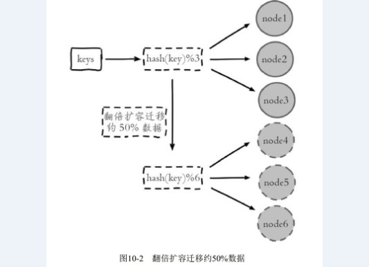
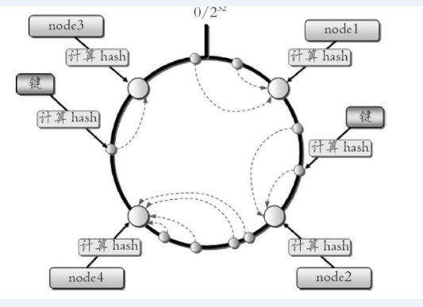
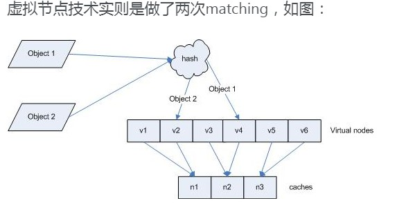
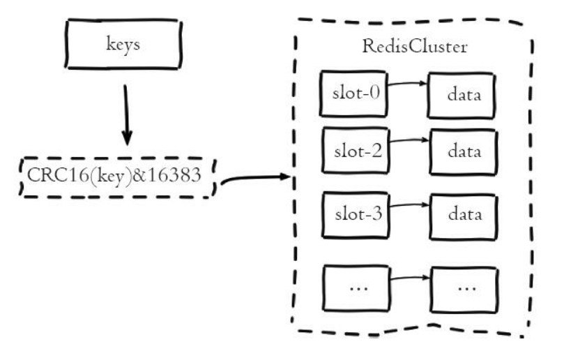

2018-05-12

## 集群

### 数据分布
1. 节点取余分区: 使用特定数据, 根据节点数量N--hash(key) % N
    - 优点:
        - 简单
    - 缺点
        - 节点数量变化的时候(扩容或者是收缩), 数据节点映射关系需要重新计算, 导致数据的迁移
    - 
    

2. 一致性哈希分区: 为系统中每一个节点分配一个Token, 0-2的32次方, 构成一个 hash环, 数据插入时, 计算key的hash, 顺势针找到
    第一个大于等于该hash的Token节点
    - 优点:
        - **加入或者删除节点只影响哈希环中相邻的节点**
    - 缺点:
        - 加减节点之后会造成环中部分数据无法命中, 需要重新拉取. **一致性哈希常用于缓存场景**
        - 使用少量节点是, 节点变化将大范围的影响环中的数据,
        - 普通的一致性哈希需要增减节点是 需要 增加一倍或者减去一半节点才能保证数据和负载的均衡
    - 
    

3. 虚拟槽分区(改进)
    - http://afghl.github.io/2016/07/04/consistent-hashing.html 
    - 希望每一个object落在任意一个cache的机会都尽可能接近。
    - **只要cache足够多，每个cache在圆环上就会足够分散**
    
    
### Redis 虚拟槽分区

1. 解耦数据和节点之间的关系, 简化了节点扩容和收缩难度
2. 节点自身维护槽的映射关系, 不需要客户端或者代理服务器维护槽分区数据
3. 支持节点, 槽, 键 之间的映射查询, 用于数据路由, 在线伸缩等场景 

### 集群功能限制
1. key批量操作支持有限
2. key事务操作支持有限
3. key作为数据分区的最小粒度, 无法将一个大对象映射到不同节点
4. 不支持多数据库空间, **集群模式只能使用 db-0**
5. **复制结构只支持一层, 从复制主, 不支持嵌套树状**

### 搭建集群
1. TODO
    
### 节点通讯
1. TODO

### 集群伸缩 
1. 槽个数据在节点之间的移动
2. 新槽会接受多个槽的数据, 而不是一个

