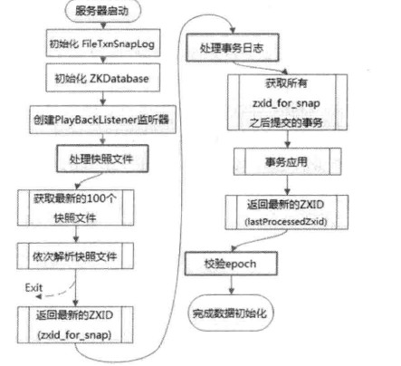

2019-05-07

## 数据和存储

### 内存数据存储
1. DataTree
    - nodes: ConcurrentHashMap<String, DataNode>
    - dataWatches: WatchManager
    - childWatches: WatchManager
    - ephemerals(临时节点): Map<Long, HashSet<String>>
2. DataNode
    - parent
    - data
    - acl
    - stat
    - children
    
### 事务日志
1. **实现数据一致性过程中最重要的一部分**
1. 文件存储
    - dataDir: 默认存储事务日志文件
    - dataLogDir: 也可以单独配置
    - 文件特点
        - 大小一致 64MB
        - **文件名后缀有规律, 事务ID, ZXID, 写入该事务日志文件第一条事务日志的 ZXID**
            - 迅速定位某一个事务操作所在的日志文件
            - zxid:高32当前leader周期(epoch), 低32 真正的操作序列号
    - 日志格式
        - TODO
    - 日志写入
        - 确定是否有日志可以写入
            - **服务器启动完成需要进行第一次事务日志的写入**
            - 上一个事务日志写满, 
        - 事务日志文件是否需要扩容(预分配)
            - 磁盘空间预分配策略: 剩余空间不足 4KB
                - 在文件创建之初, 就向操作系统预分配一个很大的磁盘块
        - 事务序列化
        - 生成CheckNum
            - 保证事务日志文件的完整性和数据的准确性
        - 写入事务日志文件流
        - 事务日志刷入磁盘
            - 写入数据流, 缓存, 无法实时写入磁盘文件
            - force--> 底层的fsync 接口
            - zookeeper.forceSync 参数开指定
        
### 数据快照
1. 某一个时刻的全量内存数据内容, 并写入指定磁盘文件中
2. 文件存储
    - dataDir
    - 文件名后缀: 本次快照开始时刻的服务器最新 ZXID
        - 根据这个ZXID 来确定从事务日志恢复的起始点
3. 数据快照
    - 在进行若干次事务操作后, 将内存数据全量数据Dump到本地文件
    - snapCount
    - 步骤
        - 是否需要进行数据快照
            - 考虑到数据快照对机器的整体性能的影响, 避免所有集群在同一个时刻进行数据快照
            - 过半策略
                - logCount > (snapCount / 2 + randRoll)     
                - logCount: 已经记录的事务日志数量
                - randRoll: 1-snapCount/2 之间的随机数
        - 切换事务日志文件
            - 当前的事务日志已经 "写满", 重新创建一个新的日志文件
        - 异步线程进行快照
        - 获取全量数据和会话信息
        - 生成快照数据文件名
        - 数据序列化

### 初始化

1. 从快照文件**加载数据快照和根据事务日志进行数据修正**两个过程
1. 步骤
    - 初始化 FileTxnSnapLog
    - 初始化 ZKDatabase
    - 创建 PlayBackListener
    - 处理快照文件
    - 获取最新的100个快照
    - 解析快照文件
        - 逐个解析
        - 只有在解析最新的快照不可用的时候才会逐个解析
    - 获取最新的 ZXID
        - zxid_for_snap
    - 处理事务日志
    - 获取所有 zxid_for_snap 之后提交的事务
    - 事务应用
    - 获取最新的 zxid
        - 获取上次正常运行时,提交的最大的事务id
    - 校验 epoch
    
### 数据同步
1. Learner 新加入集群
2. TODO
    
### 磁盘数据存储